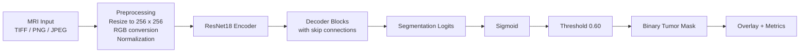
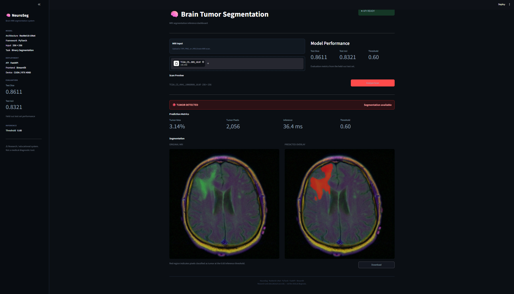
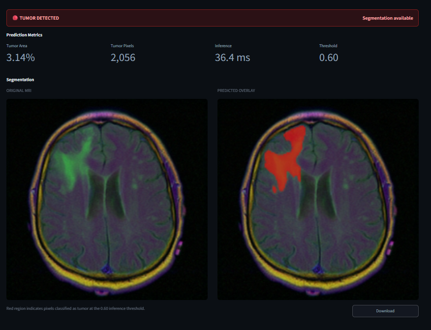
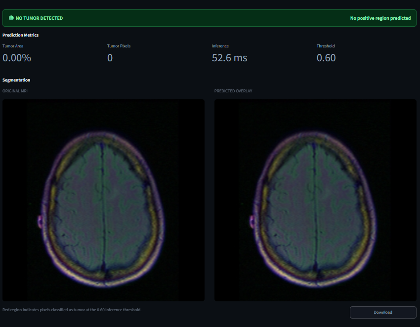

# NeuroSeg - Brain Tumor Segmentation

NeuroSeg is a brain MRI tumor segmentation project built with PyTorch, FastAPI, and Streamlit. It uses a ResNet18 encoder with a U-Net style decoder to highlight tumor regions on MRI scans.

> Important: this is a research and educational project only. It is not a medical diagnostic tool.

## ResNet18-U-Net Structure

At the core of NeuroSeg is a hybrid segmentation network:

- Encoder: `ResNet18` from `torchvision`
- Decoder: custom U-Net style blocks with skip connections
- Output: single-channel binary mask
- Inference step: sigmoid activation followed by thresholding at `0.60`

### Why this structure

- `ResNet18` gives a strong and efficient feature extractor
- Skip connections preserve spatial detail for pixel-level segmentation
- The decoder reconstructs the mask from compressed encoder features
- Binary output keeps the task focused on tumor vs background

### Architecture flow



### Internal tensor flow

The model follows the standard encoder-decoder progression:

- Input: `[B, 3, 256, 256]`
- Encoder feature maps:
  - `[B, 64, 128, 128]`
  - `[B, 64, 64, 64]`
  - `[B, 128, 32, 32]`
  - `[B, 256, 16, 16]`
  - `[B, 512, 8, 8]`
- Decoder progressively upsamples and merges encoder features
- Output: `[B, 1, 256, 256]`

## Project snapshots

The screenshots below are from the actual NeuroSeg interface and prediction flow.

### Dashboard



### Tumor detected example



### No tumor detected example



## What the project does

Given a brain MRI image, NeuroSeg:

1. Preprocesses the image to a fixed `256 x 256` input size
2. Runs the image through the `ResNet18-UNet` segmentation model
3. Converts model output logits into a probability mask using a sigmoid activation
4. Applies a threshold of `0.60` to create a binary tumor mask
5. Overlays the predicted mask on the original MRI scan
6. Returns metrics such as tumor area, tumor pixel count, and inference time

The dashboard in `app.py` lets you upload an MRI file and visually inspect the prediction.

## Project structure

```text
.
├── app.py                  # Streamlit dashboard
├── main.py                 # Minimal entry point placeholder
├── pyproject.toml          # Project metadata and dependencies
├── src/brain_seg/
│   ├── api.py              # FastAPI inference service
│   ├── dataset.py          # Dataset discovery, transforms, loaders
│   ├── inference.py        # Inference wrapper and preprocessing
│   ├── losses.py           # BCE + Dice loss
│   ├── metrics.py          # Dice, IoU, precision, recall, etc.
│   ├── model.py            # ResNet18-UNet architecture
│   └── train.py            # Training loop and MLflow logging
├── scripts/                # Utility scripts for evaluation and visualization
├── outputs/                # Saved checkpoints, plots, predictions, evaluation
└── tests/                  # Basic tests
```

## Dataset format

The training code expects TIFF images in `data/raw` with matching mask files.

### Naming convention

- Image file: `sample_001.tif`
- Mask file: `sample_001_mask.tif`

The loader searches recursively under `data/raw` and pairs files using the `_mask` suffix.

### Expected data shape

- MRI image: `H x W x 3`
- Mask: grayscale, where values greater than `0` are treated as tumor pixels

If the input image is grayscale, it is converted to RGB by duplicating the channel.

## Preprocessing and augmentation

### Training transforms

The training pipeline applies:

- Resize to `256 x 256`
- Horizontal flip
- Vertical flip
- Random 90 degree rotations
- Random affine transforms
- Normalization with mean `0.5` and std `0.5`
- Conversion to PyTorch tensors

### Validation and inference transforms

Validation and inference use:

- Resize to `256 x 256`
- Normalization with mean `0.5` and std `0.5`
- Conversion to tensor

## Loss function

The model is trained using a combined loss:

- `BCEWithLogitsLoss`
- Dice loss

The final loss is a weighted combination:

- BCE weight: `0.5`
- Dice weight: `0.5`

This combination helps the model learn both pixel-level classification and overlap quality.

## Metrics

NeuroSeg reports the following segmentation metrics:

- Dice score
- Intersection over Union (IoU)
- Precision
- Recall
- Specificity
- Accuracy

During training, Dice and IoU are tracked for both train and validation sets. During evaluation, metrics are saved to `outputs/evaluation/metrics.json`.

## Training setup

The default training configuration in `src/brain_seg/train.py` uses:

- Input size: `256`
- Batch size: `8`
- Epochs: `20`
- Optimizer: `AdamW`
- Learning rate: `1e-3`
- Weight decay: `1e-4`
- LR scheduler: `ReduceLROnPlateau`
- Mixed precision: enabled when CUDA is available
- Seed: `42`

Training also logs parameters, metrics, and artifacts to MLflow.

## Reported performance

The project currently exposes these held-out test metrics in the API and dashboard:

- Test Dice: `0.8611`
- Test IoU: `0.8321`
- Default threshold: `0.60`

The inference dashboard also displays tumor area, tumor pixel count, and inference latency in milliseconds.

## Installation

This project uses `uv` for dependency management.

### 1. Create the environment

```bash
uv sync
```

### 2. Verify the package is installed

```bash
uv run python -c "import brain_seg; print('brain_seg imported successfully')"
```

If you prefer not to use `uv`, you can install the dependencies from `pyproject.toml` with your own Python environment, but `uv` is the recommended path.

## Data setup

Place the dataset under:

```text
data/raw/
```

The training and evaluation scripts assume that path by default.

If the folder is empty or missing, the dataset loader will fail because it cannot find image-mask pairs.

## Training

Run training from the repository root:

```bash
uv run python -m brain_seg.train
```

If your environment does not resolve the module path that way, you can also run:

```bash
uv run python src/brain_seg/train.py
```

During training the best checkpoint is saved to:

```text
outputs/checkpoints/best_model.pth
```

## Evaluation

To evaluate the saved checkpoint on the test split:

```bash
uv run python scripts/evaluate.py
```

This generates:

- `outputs/evaluation/metrics.json`

To create a bar chart of the evaluation metrics:

```bash
uv run python scripts/plot_metrics.py
```

To inspect sample predictions:

```bash
uv run python scripts/plot_predictions.py
```

To visualize dataset samples:

```bash
uv run python scripts/visualize_dataset.py
```

## Threshold tuning

The project includes a helper script to sweep thresholds and find the best Dice score on the validation set:

```bash
uv run python scripts/find_threshold.py
```

The default production threshold used by the API and UI is `0.60`.

## Running the API

The FastAPI service loads the checkpoint from:

```text
outputs/checkpoints/best_model.pth
```

Start the API with:

```bash
uv run uvicorn brain_seg.api:app --reload
```

The API is then available at:

- `http://127.0.0.1:8000`

### API endpoints

- `GET /`
  - Returns service name, model name, device, and threshold
- `GET /health`
  - Returns health status and CUDA availability
- `GET /model/info`
  - Returns parameter count and evaluation details
- `POST /predict`
  - Accepts an uploaded MRI image and returns a prediction overlay plus metrics

### Example request

```bash
curl -X POST "http://127.0.0.1:8000/predict" \
  -F "file=@path/to/brain_scan.tif"
```

### Example response fields

- `tumor_detected`
- `tumor_area_pixels`
- `tumor_percentage`
- `inference_time_ms`
- `threshold`
- `image_size`
- `model`
- `device`
- `overlay`

The `overlay` field is a Base64 encoded PNG image showing the predicted tumor region.

## Running the Streamlit dashboard

The dashboard in `app.py` calls the FastAPI service, so the API should be running first.

Start the UI with:

```bash
uv run streamlit run app.py
```

Then open the local Streamlit URL shown in the terminal.

### Dashboard behavior

- Upload a TIFF, PNG, or JPEG MRI scan
- Click `Analyze Scan`
- View the original scan and predicted overlay side by side
- Download the overlay image if needed

## Inference flow

The production inference wrapper in `src/brain_seg/inference.py` performs the following steps:

1. Loads the checkpoint onto CPU or CUDA automatically
2. Converts grayscale input to RGB when needed
3. Resizes and normalizes the image
4. Runs the model in inference mode
5. Applies sigmoid to logits
6. Thresholds the probability map at `0.60`
7. Computes tumor pixel count, tumor percentage, and inference time

## Important implementation details

- The model is trained with ImageNet-pretrained `ResNet18` encoder weights by default
- The inference wrapper loads the saved checkpoint and sets `pretrained=False` because weights come from the checkpoint
- The app supports `TIFF`, `PNG`, `JPG`, and `JPEG` uploads
- Masks are binary, so this is a two-class segmentation problem
- The project uses MLflow for experiment tracking

## Troubleshooting

### The API says the model file is missing

Make sure `outputs/checkpoints/best_model.pth` exists. If not, train the model first or copy the checkpoint into that path.

### The Streamlit app cannot connect to the API

Start the FastAPI server first, then launch Streamlit.

### No image-mask pairs are found

Check that your dataset is stored under `data/raw` and that each image has a matching `_mask.tif` file.

### CUDA is not available

The project automatically falls back to CPU. It will still run, but inference and training may be slower.

## File references that matter most

- `src/brain_seg/model.py`
- `src/brain_seg/inference.py`
- `src/brain_seg/api.py`
- `src/brain_seg/train.py`
- `src/brain_seg/dataset.py`
- `app.py`

## Suggested workflow

1. Put the dataset in `data/raw`
2. Train the model
3. Evaluate the checkpoint
4. Start the FastAPI server
5. Start the Streamlit dashboard
6. Upload a scan and inspect the overlay

## License

Add your preferred license here if the project will be shared publicly.
